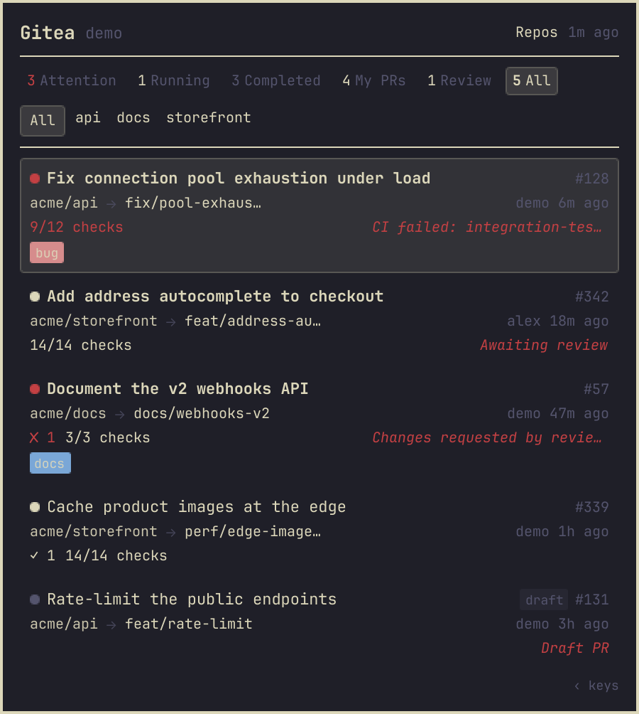

# Gitearchy

[](https://github.com/basecamp/omarchy)
[](https://about.gitea.com)
[](https://quickshell.org)
[](LICENSE)
[](https://ko-fi.com/snuffomega)

Your self-hosted Gitea, right in the Omarchy bar. Gitearchy keeps failed CI, requested reviews, running jobs and merge-ready pull requests one glance away, with a keyboard-friendly panel for the details and desktop notifications when something changes.



- **Bar summary:** failed CI, reviews waiting on you, running jobs and ready-to-merge PRs, in your theme's colors.
- **Drop-down panel:** Attention, Running, Completed, My PRs and Review sections, one click or keypress from any PR, job or repo.
- **Honest merge status:** approvals, requested changes, conflicts, drafts and CI are combined into one status per PR, with a short "blocked by" note.
- **Pick your repos:** choose which repositories appear in the bar; hidden ones still notify you.
- **Quiet notifications:** alerts fire when a PR or job changes state, never on every refresh, and never in a flood at login.
- **Read-only and resilient:** it only reads from Gitea, and keeps showing the last good data when your server or network hiccups.

## Requirements

- Omarchy 4 (verified on 4.0.4)
- A Gitea server, 1.19 or newer (1.20 or newer for Actions/CI runs)
- A Gitea access token with read-only scopes: `read:issue`, `read:repository`, `read:user`

Everything else it needs (`bash`, `curl`, `jq`, `flock`, `notify-send`, Quickshell) ships with Omarchy.

## Install

```bash
omarchy plugin add https://github.com/snuffomega/gitearchy --enable
```

Or install by hand from a copy of this folder:

```bash
mkdir -p ~/.config/omarchy/plugins/io.github.snuffomega.gitearchy
cp -a . ~/.config/omarchy/plugins/io.github.snuffomega.gitearchy/
omarchy plugin enable io.github.snuffomega.gitearchy
```

## Setup

1. **Create a token.** In Gitea, open *Settings → Applications*, generate a token, and give it the three read-only scopes above.
2. **Save your credentials.** They live outside the plugin, readable only by you:

   ```bash
   mkdir -p ~/.config/gitea-workstatus
   cat > ~/.config/gitea-workstatus/credentials << 'EOF'
   GITEA_URL="https://git.example.com"
   GITEA_TOKEN="your-gitea-api-token"
   EOF
   chmod 600 ~/.config/gitea-workstatus/credentials
   ```

3. **Restart the shell:** `omarchy restart shell`. The widget appears in the bar and fills in after its first refresh.

## Uninstall

```bash
omarchy plugin remove io.github.snuffomega.gitearchy
```

That removes the plugin and its bar widget. Your credentials and the cached snapshot live outside the plugin. Delete them too if you're done for good:

```bash
rm -rf "${XDG_CONFIG_HOME:-$HOME/.config}/gitea-workstatus" "${XDG_STATE_HOME:-$HOME/.local/state}/omarchy/gitea-workstatus"
```

## Using it

### The bar

| Indicator | Meaning |
|-----------|---------|
| ✘ N (urgent color) | N PRs with failed CI |
| ● N (accent color) | N PRs waiting on your review |
| ◦ N (accent, pulsing) | N jobs running |
| ✔ N | N PRs approved with CI passing, shown when nothing needs attention |

The icon turns urgent when something needs attention, dims while data is stale, and shows `!` when the last refresh failed. Left-click opens the panel, and right-click refreshes.

### The panel

| Section | Shows |
|---------|-------|
| Attention | PRs with failed CI, requested changes, or waiting on your review |
| Running | CI jobs in progress |
| Completed | Recent job results |
| My PRs | PRs you opened |
| Review | PRs where you're a requested reviewer |
| All | Every open PR |

Click a card to open it in Gitea, or click its repo name to open the repository. The chips under the sections narrow the panel to one repo.

| Key | Action |
|-----|--------|
| `j` / `k` | Move down / up |
| `h` / `l` | Previous / next section |
| `g` / `G` | First / last item |
| `Enter` | Open the selected item |
| `r` | Refresh now |
| `s` | Open the repo picker |
| `?` | Show or hide these key hints (also the "‹ keys" control at the bottom-right) |
| `Esc` | Close (or leave the picker) |

### Choosing repos

Open the panel and choose **Repos** (or press `s`) to see every repository your token can read. Toggle a repo to show or hide it in the bar and panel, or use **Show all** / **Hide all** on the filtered list. Your choice is saved and survives restarts. Hidden repos still send notifications, and a repo that becomes active later shows up by default.

A repo only appears in the bar or panel while it has open PRs or CI runs, so a quiet repo you've selected shows nothing until there's activity.

## Configuration

Settings live on the widget's entry in `~/.config/omarchy/shell.json`.

| Setting | Default | What it does |
|---------|---------|--------------|
| `refreshIntervalSec` | `180` | How often to poll Gitea, in seconds |
| `notifyOnFailure` | `true` | Notify when a PR's CI or a job fails |
| `notifyOnReviewRequest` | `true` | Notify when your review is requested |
| `maxStaleHours` | `6` | How long last-good data may be carried forward when a refresh partly fails |
| `giteaUrl` | — | Used for the "Open Gitea" link on the error screen (the collector reads the URL from your credentials file) |
| `hiddenRepos` | `[]` | Repos hidden from the bar and panel; the repo picker writes this for you |
| `mutedRepos` | — | Older comma-separated form of `hiddenRepos`; folded in on the first picker save |

## Troubleshooting

- **`!` in the bar:** the last refresh failed. Open the panel to see why; a missing credentials file, a wrong URL or an expired token are the usual causes.
- **Nothing shows up:** check that the credentials file exists and that the token has the three read scopes, then press `r` in the panel.
- **You edited the plugin and nothing changed:** Omarchy's hot reload doesn't always pick up panel files. Run `omarchy restart shell`.
- **"Ready" isn't mergeable:** Gitea doesn't expose branch-protection rules through its API, so an approved PR with green CI can still be blocked by a required check. The merge button in Gitea has the final word.

## Support

If Gitearchy saves you a trip to the browser, you can [buy me a coffee on Ko-fi](https://ko-fi.com/snuffomega). Bug reports and ideas are welcome as issues.

## Development

### How it works

A Bash and jq collector (`bin/gitea-collect`) reads the Gitea API with your token and writes a snapshot to `~/.local/state/omarchy/gitea-workstatus/overview.json`. It writes atomically, holds an `flock` so only one collector runs at a time, and keeps a separate error file so a failure never overwrites good data. When one request fails, only that repo's data is carried forward and the snapshot is marked stale. The QML widget watches the snapshot, and `Model.js` turns it into bar counts, panel sections and notifications. A repo that failed to collect stays quiet until it recovers, while the rest keep notifying.

```
gitearchy/
├── manifest.json        Plugin manifest (bar widget)
├── BarWidget.qml        Bar indicator, snapshot watcher, collector runner, notifications
├── Panel.qml            Drop-down panel
├── Model.js             Filtering, sections and notification logic
├── components/          Cards, section badges, repo chips, repo picker, empty and error states
├── bin/
│   ├── gitea-collect    Collector
│   └── gitea-collect.jq PR and run classification
├── preview.png          README and marketplace image, rendered from demo data
├── tools/screenshot/    Renders the README screenshot off-screen
└── tests/               Offline test suites and Gitea API fixtures
```

### PR status

| Status | Meaning |
|--------|---------|
| `approved_ci_passed` | Approved, CI passed, and mergeable (or unknown) |
| `approved` | Approved, CI not yet passed |
| `ci_passed` | CI passed, no approvals yet |
| `ci_running` | CI checks pending |
| `ci_failed` | CI failed or errored |
| `changes_requested` | A reviewer's latest review requests changes |
| `review_requested` | You're a requested reviewer |
| `draft` | Draft PR, never classified as ready |
| `conflicted` | Merge conflicts |
| `open` | None of the above |

Only each reviewer's latest review counts, so changes requested and later approved reads as approved.

### Tests

Run the offline suites; no network, Gitea or Quickshell needed:

```bash
bash tests/run-all.sh
```

| Suite | Covers |
|-------|--------|
| `test-jq-transform.sh` | PR classification, draft, conflict and mergeability guards, latest review per reviewer, blockers, CI summaries, legacy and current Actions run shapes, section bucketing |
| `test-model.sh` | Section and focus filtering, hidden repos leaving counts but still notifying, the repo picker, per-repo stale policy, cold-start suppression, per-item notification transitions, run failures |
| `test-collector-validation.sh` | Exit codes, malformed and partial responses, pagination, per-resource carry-forward, stale metadata, the full repo list, PR-disabled repos, transport failures, lock contention |

Not covered offline: manifest validity (`omarchy plugin validate .`), a live Gitea server, desktop notifications, and anything that needs a click in the running bar.

### Trying a change live

```bash
omarchy plugin validate .
cp -a . ~/.config/omarchy/plugins/io.github.snuffomega.gitearchy/
omarchy restart shell
```

Always restart the shell after changing `Panel.qml` or anything in `components/`: hot reload refreshes the bar widget but can keep an old panel. To read the shell's log for plugin errors:

```bash
qs log --pid "$(pgrep -f '^quickshell -n -p /usr/share/omarchy/shell')" 2>&1 | grep io.github.snuffomega.gitearchy
```

### Updating the screenshot

The README image is rendered from made-up demo data (`acme/*` repos), never from a real Gitea server, using the real panel code in your current Omarchy theme:

```bash
bash tools/screenshot/render.sh            # writes preview.png (All section)
bash tools/screenshot/render.sh attention  # another section, same output path
```

### Omarchy APIs used

| Import | Used |
|--------|------|
| `Quickshell` | `Quickshell.env()`, `Quickshell.execDetached()`, `Qt.openUrlExternally()` |
| `qs.Ui` | `Ui.BarWidget` (`setting()`, `bar`, `settings`), `Ui.PopupCard`, `Ui.TextField`, `Ui.Toggle` |
| `qs.Commons` | `Color.{foreground,muted,accent,urgent}`, `Color.popups.*`, `Style.space()`, `Style.bar.sizeHorizontal`, `Style.font.family` |
| `Quickshell.Io` | `FileView`, `Process`, `StdioCollector` |

The repo picker saves through the bar's `shell.updateEntryInline()`, the same call Omarchy's own tray widget uses.

### Limitations

- Branch protection isn't visible through Gitea's API, so "ready" is a best guess.
- Actions data needs Gitea 1.20 or newer; repos with Actions disabled simply show no runs.
- It polls on a timer and doesn't receive webhooks.
- One Gitea server and one account per install.

## License

Built by Casita Labs and released under the [MIT License](LICENSE).
